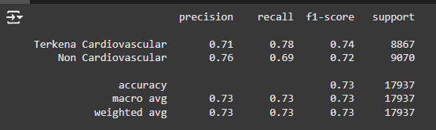

# Laporan Proyek Machine Learning - Marcel Aditya Pamungkas

## Domain Proyek

Penyakit cardiovascular merupakan jenis penyakit jantung yang disebabkan kurang pasokan darah ke jantung [1]. cardiovascular menjadi penyebab kematian nomor 2 setelah stroke, menyumbang 12,9% dari seluruh kematian di Indonesia [2]. menurut [3], terdapat keterkaitan erat antara obesitas dengan kejadian cardiovascular di RS Umum Bahteramas. Obesitas dapat menyebabkan terjadinya peningkatan pada tekanan darah/ hipertensi, kadar trigliserida, kolesterol, resistensi glukosa, dan risiko penggumpalan darah, yang semuanya terkait dengan cardiovascular. Obesitas merupakan kelebihan lemak di jaringan adiposa dan merupakan salah satu dari masalah paling umum yang dapat muncul dan dapat dicegah dengan banyak bergerak[4]. gaya hidup juga keterkaitan dengan cardiovascular dan obesitas. maka observasi yang dilakukan menggunakan variabel umur dalam hari, gender, tinggi badan, berat badan, tekanan darah, kadar cholesterol, kadar glukosa, merokok,alcohol,	activitas,	terkena penyakit cardiovascular. Tentu akan lebih baik jika cardiovascular dapat dideteksi sedini mungkin.<br>

Pada zaman sekarang, teknologi telah berkembang pesat, salah satunya adalah teknologi *machine learning*. *machine learning* telah digunakan ke dalam berbagai bidang, salah satunya bidang kesehatan. *machine learning* mampu mendeteksi berbagai macam penyakit dengan berbagai parameter maupun faktor yang diberikan, salah satunya adalah mendeteksi cardiovascular. Oleh sebab itu, pada proyek ini, penulis ingin memanfaatkan *machine learning* untuk mendeteksi terkena cardiovascular pada seseorang, terutama yang didiagnosis mengalami obesitas agar dapat icegah. Penulis ingin memprediksi penyakit cardiovascular pada responden menggunakan 7 model, yaitu *Extreme Gradient Boosting* (XGBoost), *Support Vector Machine* (SVM), *K-Nearest Neighbors* (KNN), *AdaBoosting*,*Catboosting*,*Decision Tree*, dan *Random Forest*. Penulis menggunakan dataset dari Kaggle yang dapat diakses pada link [berikut](https://www.kaggle.com/datasets/sulianova/cardiovascular-disease-dataset).

 <br>

## Business Understanding

### Problem Statements
Rumusan masalah dari masalah latar belakang diatas adalah:
1.  Dari berbagai faktor yang ada, faktor mana yang paling berpengaruh terhadap terkena cardiovascular?
2.   Bagaimana mengetahui seseorang terkena cardiovascular berdasarkan rekam medis ?
3.   Bagaimana mengetahui seseorang terkena cardiovascular berdasarkan riwayat kesehatan dan aktivitas yang dilakukan?

### Goals
Berdasarkan problem statements, berikut tujuan yang ingin dicapai pada proyek ini.
1. Mengetahui  faktor tiga faktor yang paling berpengaruh terhadap terkena seseorang terkena cardiovascular.
2. Mengetahui faktor-faktor yang terkena penyakit cardiovascular berdasarkan rekam medis.
3. Menemukan model terbaik berdasarkan akurasi tertinggi untuk memprediksi penyakit cardiovascular pada responden.

### Solution Statement

1.   analisis pada data untuk memahami fitur-fitur yang mempengaruhi orang terkena cardiovascular, dengan menerapkan teknik visualisasi data dan deskripsi statistik data mengetahui korelasi antar fitur dan memahami hubungan antara data target (label) dan fitur lainnya.
2.   Menggunakan algoritma machine learning untuk membandingkan performa model untuk mendapatkan model atau algoritma yang memiliki akurasi prediksi terbaik dalam memprediksi seseorang terkena cardiovascular berdasarkan riwayat kesehatan dan aktivitas yang dilakukan. Menggunakan 7 model *machine learning* untuk memprediksi penyakit cardiovascular pada responden, yaitu *Extreme Gradient Boosting* (XGBoost), *Logistik Regression*, *Decision Tree*, *K-Nearest Neighbors* (KNN), *Catboosting*, *AdaBoosting*,dan *Random Forest*.
3. Menggunakan confusion matrix dan f1 score pada masing-masing model *machine learning* untuk menemukan model terbaik berdasarkan akurasi tertinggi.

## Data Understanding
Dataset yang digunakan untuk memprediksi seseorang *cardiovascular* pada responden diambil dari platform [kaggle](https://www.kaggle.com/) yang dipublikasikan oleh ARAVINDPCODER dengan usability score 10/10. Data ini didapat dari survei menggunakan platform web kepada orang-orang noncardiovascular dan orang cardiovascular dengan usia di rentang 30 hingga 65 tahun dan dari berbagai jenis kegiatan fisik serta rekam medis responden . Dataset ini terdiri dari 1 file csv.<br>

### Informasi Keterangan Variabel pada Data
Dataset ini memiliki 12 variabel dengan keterangan sebagai berikut.
Variabel | Keterangan
----------|----------
age |  umur dalam hari
gender| jenis kelamin (1 : perempuan, 2 untuk laki-laki)
height| tinggi badan dalam satuan cm
weight| berat badan dalam satuan
ap_hi | tekanan darah saat jantung memompa darah ke seluruh tubuh (normal:  120–129 mmHg untuk sistolik untuk sistolik)
ap_lo | tekanan darah saat jantung berelaksasi sebelum kembali memompa darah. (normal80–83 mmHg untuk diastolik)
cholesterol| 1: normal, 2: diatas normal, 3: jauh diatas normal
gluc | 1: normal, 2: diatas normal, 3: jauh diatas normal
smoke | 0: tidak merokok, 1: merokok
alco | 0: tidak minum alkohol, 1: minum alkohol
active | 0: tidak olahrga, 1: aktif olahraga
cardio | 0: tidak terkena sakit cardio, 1: terkena sakit cardio


### Data Cleaning
Setelah diperiksa apakah terdapat kolom yang bernilai null, hasilnya adalah tidak ada. Sementara itu, setelah diperiksa apakah terdapat data duplikat, ditemukan 24 duplikat, sehingga data duplikat ini dihapus. Oleh karena itu, setelah dilakukan pembersihan data, diperoleh deskripsi statistik data numerik sebagai berikut. 

| 	| gender	| height	| weight	| ap_hi	| ap_lo	| cholesterol	| gluc	| smoke	| alco	| active	| cardio	| umur|
----------|----------|----------|----------|----------|----------|----------|----------|----------|----------|----------|----------|----------
count	| 66782.000000	| 66782.000000	| 66782.000000	| 66782.000000	| 66782.000000	| 66782.000000	| 66782.000000	| 66782.000000	| 66782.000000	| 66782.000000	| 66782.000000	| 66782.000000
mean	| 1.356129	| 164.341619	| 74.522241	| 129.161990	| 97.473840	| 1.382693	| 1.236112	| 0.092121	| 0.056288	| 0.798524	| 0.511994	| 53.857372
std	| 0.478858	| 8.333598	| 14.579325	| 157.493091	| 192.913276	| 0.690109	| 0.582060	| 0.289198	| 0.230478	| 0.401106	| 0.499860	| 6.803136
min	| 1.000000	| 55.000000	| 10.000000	| -150.000000	| -70.000000	| 1.000000	| 1.000000	| 0.000000	| 0.000000	| 0.000000	| 0.000000	| 30.000000
25%	| 1.000000	| 159.000000	| 65.000000	| 120.000000	| 80.000000	| 1.000000	| 1.000000	| 0.000000	| 0.000000	| 1.000000	| 0.000000	| 49.000000
50%	|  1.000000	| 165.000000	| 72.000000	| 120.000000	| 80.000000	| 1.000000	| 1.000000	| 0.000000	| 0.000000	| 1.000000	| 1.000000	| 54.000000
75%	| 2.000000	| 170.000000	| 83.000000	| 140.000000	| 90.000000	| 2.000000	| 1.000000	| 0.000000	| 0.000000	| 1.000000	| 1.000000	| 59.000000
max	| 2.000000	| 250.000000	| 200.000000	| 16020.000000 |	11000.000000	| 3.000000	| 3.000000	| 1.000000	| 1.000000	| 1.000000	| 1.000000	| 65.000000


Dari hasil tersebut, dapat disimpulkan bahwa responden memiliki rentang usia 30-65 tahun dengan tinggi rentang 0.5-2.5 meter dan berat rentang 10-200 kilogram, sedangkan tekanan sistolik -150 hingga 16020 dan diastolik -70 hingga 11000. Dari hasil tersebut, kita perlu melakukan hapus outlier dan pengecakan lebih lanjut

 <br>

boxplot setelah dilakukan penghapusan outlier diketahui bahwa:

1. Pada kolom `Weight`, dapat dilihat bahwa mayoritas responden memiliki berat badan di rentang 65-85 kilogram. Terdapat beberapa outlier. meski demikian, outlier ini akan tidak dihapus karena memungkinan memiliki berat 110 kg.
2. Pada kolom `Height`, dapat dilihat bahwa mayoritas responden memiliki tinggi badan di rentang 1,55-1,7 meter. Terdapat banyak outlier. Dengan demikian, outlier ini akan ditangani karena sangat kecil kemungkinan umur 30 keatas memiliki rentang 0,5 meter hingga 1 meter.
3. Pada kolom `ap_hi`, dapat dilihat bahwa rentang tekanan darah diastolik responden rentang 120 mmHg - 140 mmHg.
4. Pada kolom `ap_lo`,  dapat dilihat bahwa rentang tekanan darah diastolik responden rentang 80 mmHg - 90 mmHg.

Untuk proses analisis ini, Data sudah siap untuk diproses dan dianalisis.

### Univariate Analysis

Dari variabel-variabel yang diketahui, variabel dapat dibagi menjadi 2 jenis, yaitu variabel numerikal dan variabel kategorikal. Berikut merupakan kolom-kolom yang termasuk dalam variabel numerikal maupun kategorikal. <br>
Kolom-kolom numerikal: ['umur', 'height', 'weight', 'ap_hi', 'ap_lo'] <br>
Kolom-kolom kategorikal: ['gender','cholesterol', 'gluc', 'smoke', 'alco', 'active', 'cardio']
Pertama, kita akan memvisualisasikan kolom-kolom kategorikal untuk melihat jumlah-jumlah nilai kategorikal menggunakan bar plot.

 <br>

Gambar di atas dapat diinterpretasikan sebagai berikut.
1. Dari `Plot Jumlah dari Riwayat terkena penyakit cardiovascular`, responden yang dijadikan responden imbang antara terkena cardiovascular dan non cardiovascular.
2. Dari `Plot Jumlah dari Frekuensi gender`, mayoritas responden laki-laki dan sisanya merupakan wanita.
3. Dari `Plot Jumlah dari tingkat kadar kolesterol`, mayoritas responden memiliki kadar normal.
4. Dari `Plot Jumlah dari tingkat kadar gula`, mayoritas responden memiliki kadar gula normal.
5. Dari `Plot Jumlah dari smoke`, mayoritas responden tidak merokok.
6. Dari `Plot Jumlah dari meminum alkohol`, sebagian besar responden terkadang tidak minum alkohol dan sebagian kecil responden meminum alkohol.
7. Dari `Plot Jumlah dari aktif bergerak`, mayoritas responden menggunakan sudah aktif bergerak dibandingkan tidak aktif bergerak

 <br>

Gambar di atas dapat diinterpretasikan sebagai berikut.
1. Plot Histogram dari `Height`, `Weight`, `ap_hi`,`ap_lo` berdistribusi normal.
2. Plot Histogram dari `active`, `cardio`, `alco`, `gluco`, `smoke`,`gender` cukup berdistribusi normal.
3. Plot Histogram dari `Umur`  memiliki distribusi data yang miring ke kanan. Artinya, mayoritas data memiliki nilai di diatas rata-rata.


### Multivariate Analysis

#### 1. membandingkan kondisi kesehatan jantung dengan jenis kelamin

 <br>

Dari gambar di atas, dapat disimpulkan bahwa
1. Penyakit cardiovascular didonmiasi oleh perempuan dibandingkan laki-laki.
2. responden yang tidak terkena penyakit cardiovascular juga masih didominasi oleh perempuan.

#### 2. membandingkan kondisi kesehatan jantung dengan umur

 <br>
Dari gambar di atas, disimpulkan bahwa
1. Seluruh responden terkena cardiovascular berusia diatas 40 tahun.
2. Seluruh responden non cardiovascular direntang 30-65 tahun.

#### 3. Membandingkan kondisi kesehatan jantung dengan tingkat kadar gula

 <br>
Dari gambar di atas, disimpulkan bahwa:
1. Mayoritas kadar glukosaa normal banyak yang tidak terkena cardiovascular dibandingkan dengan yang terkenan cardiovascular.
2. penyandang cardiovascular yang memiliki kadar glukosa melebihi diatas rata-rata naik cukup signifikan 2 kali lipat dibandingkan yang noncardiocascular.

#### 4. membandingkan kondisi kesehatan jantung dengan tingkat kadar kolesterol

 <br>

Dari gambar di atas, disimpulkan bahwa
1. Mayoritas kadar kolesterol normal banyak yang tidak terkena cardiovascular.
2. penyandang cardiovascular yang memiliki kadar kolesterol melebihi diatas rata-rata naik cukup signifikan dibandingkan yang noncardiocascular.

#### 5. Melihat Korelasi Variabel dengan Menggunakan Heatmap

 <br>

Dari heatmap di atas, dapat dilihat bahwa berat badan responden memiliki
1. Korelasi positif yang cukup kuat dengan tinggi dibandingkan faktor numerik lain.
2. Korelasi positif yang sangat lemah terhadap usia.
3. Korelasi positif yang lemah terhadap tekanan sistolik.
4. Korelasi positif yang lemah terhadap tekanan diastolik.


## Data Preparation
Pertama, akan diubah nilai-nilai kategorikal pada data menggunakan encoder sehingga menjadi nilai-nilai numerik agar dapat dilatih dengan *machine learning*.

### Encoding Kategorikal
Encoding Kategorikal dilakukan terhadap 4 variabel, yaitu
* `Active` (Apakah responden berolahraga)
* `SMOKE` (Apakah responden merupakan perokok)
* `cardio` (Apakah responden merupakan penyandang cardiovascular)
* `alco` (Apakah responden merupakan peminum alkohol)

karena nilai-nilai pada keempat variabel tersebut hanya `yes` (iya) atau `no` (tidak). Encoding ini dilakukan menggunakan `.map()`dengan cara mengganti nilai `yes` dengan `1`, dan nilai `no` dengan `0`.

### One Hot Encoding
One Hot Encoding dilakukan terhadap 3 variabel, yaitu

* `gluc` (tingkat kadar glukosa )
* `cholesterol` (tingkat kadar kolesterol)
* `Gender` (Jenis kelamin responden)

karena kategori-kategori pada kedua variabel tersebut tidak memiliki urutan tertentu. Encoding ini dilakukan menggunakan `.get_dummies()` dengan cara membuat kolom-kolom baru berdasarkan masing-masing nilai dari variabel tersebut, mengisinya dengan `True` atau `False` sesuai dengan keadaan, lalu menghapus kedua kolom aslinya.


### Data Training dan Testing

Tahapan ini dilakukan untuk membagi data menjadi 2, yaitu data training dan testing. Data training digunakan untuk melatih model dengan data yang ada, sedangkan data testing digunakan untuk menguji model yang dibuat menggunakan data yang belum dilatih. Pembagian data ini dilakukan dengan perbandingan 80% : 20% untuk data training dan data testing menggunakan `train_test_split` dari library sklearn.

### Standarisasi

Tahapan ini dilakukan agar algoritma machine learning memiliki performa lebih baik dan konvergen lebih cepat ketika dimodelkan pada data dengan skala relatif sama atau mendekati distribusi normal. Proses scaling dan standarisasi membantu untuk membuat fitur data menjadi bentuk yang lebih mudah diolah oleh algoritma dengan range 0 hingga 1 dan menyeragamkan karena memiliki satuan yang berbeda pada tiap fitur.

## Modeling

Ada 7 algoritma *Machine Learning* yang digunakan untuk membuat model, yaitu sebagai berikut.
### 1. ***Extreme Gradient Boosting* (XGBoost)**.

Algoritma ini bekerja dengan mengimplementasikan *decision tree* yang kemudian ditingkatkan dengan gradien untuk meningkatkan kecepatan dan kinerja. Kelebihan dari algoritma ini adalah memiliki performa dan efisiensi tinggi, efektif untuk dataset bberukuran besar, dan memiliki parameter regularisasi yang mampu mencegah *overfitting*. Sementara itu, kekurangan dari algoritma ini adalah membutuhkan ketelitian terhadap hyperparameter tuning untuk mencegah *overfitting* dan komputasi yang mahal serta membutuhkan memori yang besar untuk dataset berukuran besar. <br>

Pada pemodelan ini, XGBoost diimplementasikan menggunakan `XGBClassifier` dari library `xgboost` dengan memasukkan `X_train` dan `y_train` untuk melatih model, lalu menggunakan `X_test` dan `y_test` untuk menguji model dengan data testing yang tidak ada di data training. Parameter yang digunakan pada model ini adalah `max_depth` yaitu kedalaman maksimum setiap tree, `n_estimators` yaitu jumlah tree yang akan dibuat, `random_state` yaitu mengontrol seed acak yang diberikan pada setiap iterasi, `learning rate` yaitu mengatur langkah setiap iterasi ketika meminimumkan *loss function*, dan `n_jobs` yaitu mengatur jumlah CPU threads untuk menjalankan XGBoost. Pada proyek ini, parameter yang digunakan adalah `max_depth = 4`, `n_estimators = 118`, `random_state = 30`, `learning_rate = 0.0701335604673830`, `n_jobs = -1`.

### 2. ***Adaptive Boosting* (AdaBoost)**

AdaBoost (Adaptive Boosting) adalah algoritma boosting yang bekerja dengan membangun serangkaian model yang secara bertahap mengurangi kesalahan. Pada setiap langkah, model fokus pada kesalahan dari model sebelumnya, sehingga iterasi berikutnya akan memperbaiki kesalahan tersebut. Model ini memberikan bobot lebih pada data yang sulit diprediksi dan menggabungkan hasil dari semua model yang telah dilatih untuk menghasilkan prediksi akhir yang lebih baik. <br>

- **Cara Membuat Model**: 

  1.   ```from sklearn.ensemble import AdaBoostClassifier``` 
  
       - Mengimpor class `AdaBoostClassifier` dari pustaka scikit-learn.

  2.   ```boosting_RF = AdaBoostClassifier(estimator= model_rf, learning_rate=0.04, random_state=40)``` 

       - Membuat objek dari class `AdaBoostClassifier` dengan model dasar (`estimator`) berupa `RandomForestClassifier` yang sudah dibuat sebelumnya.

          - **Penjelasan Parameter**:

            - `estimator=rf_regressor`: Menentukan model dasar yang digunakan sebagai estimator (dalam hal ini adalah `RandomForestClassifier`).

            - `learning_rate=0.04`: Mengontrol seberapa besar kontribusi setiap estimator ke model akhir. Nilai yang lebih rendah membuat model belajar lebih lambat, tetapi lebih halus.

            - `random_state=40`: Memastikan bahwa hasil yang didapat bisa diulang (reproducible).

  3.   ```boosting_RF.fit(X_train, y_train)``` 

       - Memanggil metode fit untuk melatih model `AdaBoostClassifier` menggunakan data pelatihan `X_train` dan `y_train`.

       - `X_train`: Matriks fitur yang digunakan untuk pelatihan.

       - `y_train`: Nilai target yang sesuai dengan `X_train`.

### 3. ***K-Nearest Neighbors* (KNN)**

Algoritma ini bekerja dengan mengklasifikasikan titik data berdasarkan kelas mayoritas dari sejumlah k tetangga terdekatnya. Kelebihan dari algoritma ini adalah mudah dan simple untuk digunakan, tidak ada fase *lazy learning* sehingga cepat, dan efektif. Sementara itu, kekurangan dari algoritma ini adalah sensitif terhadap pemilihan k dan metrik jarak serta memiliki performa buruk untuk data berdimensi tinggi (*curse of dimensionality*). <br>

Pada pemodelan ini, KNN diimplementasikan menggunakan `KNeighborsClassifier` dari library `sklearn.neighbors` dengan memasukkan `X_train` dan `y_train` untuk melatih model, lalu menggunakan `X_test` dan `y_test` untuk menguji model dengan data testing yang tidak ada di data training. Parameter yang digunakan pada model ini adalah `n_neighbors` yaitu jumlah k tetangga. Pada proyek ini, parameter yang digunakan adalah `n_neighbors = 4`.

### 4. ***Random Forest***

Algoritma ini bekerja dengan membentuk decision trees, lalu menggunakan sampiing dengan penggantian (*bootstrapping*) dan pemilihan fitur acak untuk setiap pohon agar pohon-pohon menjadi beragam. Kelebihan dari algoritma ini adalah memiliki akurasi tinggi karena menggunakan pendekatan ensemble, mencegah *overfitting* dengan jumlah pohon yang banyak, dan mampu menangani dataset berukuran besar dan multi dimensi. Sedangkan kekurangan dari algoritma ini adalah komputasi yang besar untuk jumlah pohon yang besar dan membutuhkan memori yang besar untuk menyimpan seluruh pohon. <br>

Pada pemodelan ini, *Random Forest* diimplementasikan menggunakan `RandomForestClassifier` dari library `sklearn.ensemble` dengan memasukkan `X_train` dan `y_train` untuk melatih model, lalu menggunakan `X_test` dan `y_test` untuk menguji model dengan data testing yang tidak ada di data training. Parameter yang digunakan pada model ini adalah `n_estimators` yaitu jumlah tree yang akan dibuat, `criterion` yaitu fungsi untuk menentukan kualitas *splitting data*, `max_depth` yaitu kedalaman maksimum setiap tree, dan `random_state` yaitu mengontrol seed acak yang diberikan pada setiap iterasi. Pada proyek ini, parameter yang digunakan adalah `n_estimators = 100`, `criterion = "entropy"`, `max_depth = 10`, `random_state = 50`.

### 5. ***Logistik Regresion***

Logistic Regression adalah metode statistik yang digunakan untuk memprediksi probabilitas suatu hasil biner (dua kategori) berdasarkan satu atau lebih variabel independen. Meskipun mengandung kata "regression," metode ini digunakan untuk klasifikasi, bukan regresi seperti pada linear regression. Logistic regression sering digunakan dalam pembelajaran mesin dan statistik untuk memodelkan hubungan antara variabel input (fitur) dan hasil biner. <br>

Pada pemodelan ini, *Logistik Regression* diimplementasikan menggunakan `LogisticRegression` dari library `sklearn.liniear_model` dengan memasukkan `X_train` dan `y_train` untuk melatih model, lalu menggunakan `X_test` dan `y_test` untuk menguji model dengan data testing yang tidak ada di data training. Parameter yang digunakan pada model ini adalah  `solver:sag` untuk menemukan parameter terbaik (koefisien) dalam model dengan data yang besar dan sparseness tinggi dan `n_jobs=-1` diatur ke -1, model akan menggunakan semua inti yang tersedia, sehingga mempercepat proses pelatihan.

### 6. ***Decission Tree***

Decision Tree adalah algoritma pembelajaran mesin yang digunakan untuk tugas klasifikasi dan regresi. Decision tree membagi dataset menjadi subset yang lebih kecil berdasarkan aturan keputusan yang diterapkan pada fitur input. Proses ini diulang secara rekursif, menghasilkan struktur seperti pohon. memiliki kelebihan yaitu Dapat Menangani Data Kategorikal dan Numerik,algoritma dapat bekerja dengan baik untuk berbagai jenis data tanpa perlu transformasi kompleks, cepat untuk Pelatihan dan Prediksi, dan dapat Menangkap Interaksi Non-Linear, sedangkan mempunya kelemahan yaitu Bias terhadap Fitur dengan Banyak Kategori (misalnya, kode pos) dan tidak Menangani Pola Kompleks Secara Efisien. <br>

Pada pemodelan ini, *Decision Tree* diimplementasikan menggunakan `DecisionTreeClassifier` dari library `sklearn.tree` dengan memasukkan `X_train` dan `y_train` untuk melatih model, lalu menggunakan `X_test` dan `y_test` untuk menguji model dengan data testing yang tidak ada di data training. Parameter yang digunakan pada model ini adalah `min_samples_split = 26`, `criterion = "entropy"`, `max_depth = 9`, `min_samples_leaaf = 26`.

### 7. ***CatBoosting***
CatBoost mencoba memprediksi probabilitas kelas target berdasarkan fitur input dengan cara membangun model pohon keputusan secara iteratif, di mana setiap iterasi bertujuan untuk memperbaiki kesalahan model sebelumnya. Memiliki kelebihan yaitu Mengurangi Overfitting dengan Regularisasi Unik dan performa tinggi ,sedangkan memiliki kekurangan yaitu waktu training lebih lama dan memori lebih tinggi.<br>

Pada pemodelan ini, *CatBoosting* diimplementasikan menggunakan `CatBoostClassifier` dari library `catboost` dengan memasukkan `X_train` dan `y_train` untuk melatih model, lalu menggunakan `X_test` dan `y_test` untuk menguji model dengan data testing yang tidak ada di data training. Parameter yang digunakan pada model ini adalah `depth = 7`, `learning_rate = 0.06472008735372431`, `iterations = 275`, `random_strength = 8`.


### 5. Pemilihan Model

Setelah semua model dijalankan, penulis memilih algoritma *Random Forest* sebagai model terbaik yang akan digunakan sebagai solusi untuk memprediksi obesitas karena model ini memiliki akurasi dan skor f1 tertinggi dibandingkan model lainnya, serta kesalahan klasifikasi pada matriks confusion yang lebih kecil dibanding model lainnya. Penjelasan lebih lengkap mengenai alasan ini ada di bagian selanjutnya, yaitu **evaluation**.

## Evaluation

Pada proyek ini, penilaian model menggunakan confusion matrix, akurasi, dan f1 score sebagai metrik evaluasi untuk masing-masing model. Akan dijelaskan terlebih dahulu bagaimana cara mendapatkan akurasi dan f1 score serta bagaimana cara menggunakan confusion matrix.

### Sekilas Tentang Matriks Confusion, Akurasi, dan Skor f1

Matriks Confusion merupakan sebuah tabel untuk mengukur akurasi dari model klasifikasi. Contoh dari Matriks Confusion beserta labelnya dapat dilihat pada gambar di bawah ini. 

 <br>

Setiap baris pada matriks confusion merepresentasikan nilai sesungguhnya, sedangkan setiap kolom pada matriks confusion merepresentasikan nilai yang diprediksi. Terdapat 4 label pada matriks confusion seperti yang terlihat di gambar, yaitu TP, TN, FP, dan FN.
1. *True Positive* (TP) merupakan jumlah data pada positif yang ditebak dengan benar.
2. *True Negative* (TN) merupakan jumlah data pada negatif yang ditebak dengan benar.
3. *False Positive* (FP) merupakan jumlah data yang ditebak dengan salah karena diprediksi positif, sedangkan aslinya adalah negatif. Kesalahan ini sering disebut Error Tipe 1.
4. *False Negative* (FN) merupakan jumlah data yang ditebak dengan salah karena diprediksi negatif, sedangkan aslinya adalah positif. Kesalahan ini sering disebut Error Tipe 2.

Selanjutnya, metrik evaluasi yang digunakan berdasarkan label-label yang diketahui dari matriks confusion ada 4, yaitu sebagai berikut.
1. Akurasi (*Accuracy*) merupakan proporsi data yang berhasil diprediksi dengan benar dari seluruh data yang diprediksi. Akurasi dirumuskan sebagai <br>
 <br>

2. *Precision* merupakan proporsi data positif yang berhasil diprediksi dengan benar dari seluruh data yang diprediksi positif. *Precision* dirumuskan sebagai <br>
 <br>

3. *Recall* merupakan proporsi data positif yang berhasil diprediksi dengan benar dari seluruh data yang aslinya positif. *Recall* dirumuskan sebagai <br>
 <br>

4. Skor F1 (F1 *score*) merupakan rata-rata harmonik dari *precision* dan *recall* untuk mendapatkan sebuah metrik yang seimbang. Skor F1 dirumuskan sebagai <br>
 <br>

### Penerapan Matriks Confusion, Akurasi, dan Skor f1

#### 1. Model XGBoost

Berikut merupakan matriks confusion, akurasi, dan skor f1 dari model XGBoost

 <br>

Dari gambar di atas, terdapat 1996 data diklasifikasikan salah sebagai responden cardiovascular 
dan 2791 data diklasifikasikan salah sebagai responden noncardiovascular. Diperoleh skor F1 nya adalah 0.73 dengan akurasi ≈ 73.31%.

#### 2. Model Logisitik Regression

Berikut merupakan matriks confusion, akurasi, dan skor f1 dari model SVM

 <br>

Dari gambar di atas, terdapat 2914 data diklasifikasikan salah sebagai responden cardiovascular 
dan 2015 data diklasifikasikan salah sebagai responden noncardiovascular. Diperoleh skor F1 nya adalah 0.73 dengan akurasi ≈ 72.53%.

#### 3. Model KNN

Berikut merupakan matriks confusion, akurasi, dan skor f1 dari model KNN

 <br>
 <br>

Dari gambar di atas, terdapat 2436 data diklasifikasikan salah sebagai responden cardiovascular 
dan 2994 data diklasifikasikan salah sebagai responden noncardiovascular. Diperoleh skor F1 nya adalah 0.70 dengan akurasi ≈ 69.57%.

#### 4. Model *Decision Tree*

Berikut merupakan matriks confusion, akurasi, dan skor f1 dari model *Decision Tree*

 <br>
 <br>

Dari gambar di atas, terdapat 2203 data diklasifikasikan salah sebagai responden cardiovascular 
dan 2718 data diklasifikasikan salah sebagai responden noncardiovascular. Diperoleh skor F1 nya adalah 0.73 dengan akurasi ≈ 72.57%.

#### 5. Model *Random Forest*

Berikut merupakan matriks confusion, akurasi, dan skor f1 dari model *Random Forest*

 <br>
 <br>

Dari gambar di atas, terdapat 1804 data diklasifikasikan salah sebagai responden cardiovascular 
dan 3012 data diklasifikasikan salah sebagai responden noncardiovascular. Diperoleh skor F1 nya adalah 0.73 dengan akurasi ≈ 73.04%.

#### 6. Model *AdaBoost*

Berikut merupakan matriks confusion, akurasi, dan skor f1 dari model *AdaBoost*

 <br>
 <br>

Dari gambar di atas, terdapat 1990 data diklasifikasikan salah sebagai responden cardiovascular 
dan 2854 data diklasifikasikan salah sebagai responden noncardiovascular. Diperoleh skor F1 nya adalah 0.73 dengan akurasi ≈ 72.95%.


#### 7. Model *Catboosting*

Berikut merupakan matriks confusion, akurasi, dan skor f1 dari model *Catboosting*

 <br>
 <br>

Dari gambar di atas, terdapat 2079 data diklasifikasikan salah sebagai responden cardiovascular 
dan 2749 data diklasifikasikan salah sebagai responden noncardiovascular. Diperoleh skor F1 nya adalah 0.73 dengan akurasi ≈ 73.12%.

#### Hasil Evaluasi
Dari seluruh akurasi yang diketahui dari keempat model, dibentuk bar plot untuk melihat perbandingan nilai akurasi model sebagai berikut. 

 <br>

Berdasarkan gambar di atas dan evaluasi masing-masing model untuk mengetahui skor akurasi, skor F1, dan jumlah kesalahan klasifikasi pada masing-masing model, didapat model *Random Forest* merupakan model terbaik karena memiliki skor akurasi dan skor F1 tertinggi, serta jumlah kesalahan klasifikasi yang paling sedikit, terutama pada obesitas. 

 <br>
makna dari grafik tersebut menunjukan bahwa 3 faktor yang sangat berpengaruh seseorang terkena penyakit cardiovascular ,yaitu tekanan darah diastolik yang tinggi, kadar kolesterol yang sangat tinggi, dan umur.


## Kesimpulan
1. Berdasarkan data yang diperoleh, menunjukan bahwa 3 faktor yang sangat berpengaruh seseorang terkena penyakit cardiovascular ,yaitu tekanan darah diastolik yang tinggi, kadar kolesterol yang sangat tinggi, dan umur. Disimpulkan bahwa seseorang yang jika tidak ingin mencegah terkena penyakit cardiovascular harus menjaga tekanan darah diastoliknya dan menjaga kadar kolesterolnya dalam kadar normal.
2. Seluruh penyandang cardiovascular memiliki kesamaan dalam beberapa faktor, yaitu
   * memiliki kadar glukosa lebih dari rata-rata batas normal.
   * memiliki kadar kolesterol lebih dari rata-rata batas normal.
   * umur rentang 40 tahun sampai 65 tahun.
   * Wanita lebih rentang terkena cardiovascular dibandingkan pria
3. Setelah menguji data menggunakan 7 model *machine learning*, yaitu ***Extreme Gradient Boosting* (XGBoost)**, ***Logistik Regression***,***Decision Tree***,***CatBoosting*** ,***Adaboost*** , ***K-Nearest Neighbors* (KNN)**, dan ***Random Forest*** untuk mendeteksi cardiovascular, diperoleh model *XGBoost* merupakan model terbaik dibandingkan model lainnya berdasarkan skor akurasi, skor F1, dan jumlah kesalahan klasifikasi yang paling sedikit.

## Referensi
1.  M. S. Gibran and U. Nurulhuda, "The relationship between obesity and coronary heart disease incident: Hubungan antara obesitas dengan kejadian penyakit jantung koroner di Poli Jantung RS Islam Jakarta Cempaka Putih," Journal of Health and Cardiovascular Nursing, vol. 3, no. 2, pp. 57–62, 2023.

2.   Direktorat P2PTM Kemenkes RI, "Hari Jantung Sedunia (HJS) Tahun 2019: Jantung Sehat, SDM Unggul," 26 Sep. 2019.

3. Jamaluddin, "Obesitas sebagai faktor risiko penyakit jantung koroner di Rumah Sakit Umum Bahteramas Provinsi Sulawesi Tenggara," Seminar Nasional Teknologi Terapan Inovasi dan Rekayasa (SNT2IR) 2019, Program Pendidikan Vokasi Universitas Halu Oleo, vol. 2, no. 1, pp. 505–508, 2019.

4.   P. LeMone, K. M. Burke, and G. Bauldoff, Buku Ajar Keperawatan Medikal Bedah: Gangguan Integumen, Gangguan Endokrin, dan Gangguan Gastrointestinal, A. Linda, Ed., 5th ed. Jakarta: EGC, 2015.

5. P. Mayadewi and E. Rosely, "Prediksi Nilai Proyek Akhir Mahasiswa Menggunakan Algoritma Klasifikasi Data Mining," in Proceedings of SESINDO 2015, 2015.

6. A. R. Faddilah, Penerapan Optuna untuk Optimasi Hyperparameter pada Model Linear Regression dan Random Forest Regression dalam Penentuan Batas Kredit (TA. 2.24.024), Doctoral dissertation, Universitas Logistik dan Bisnis Internasional, 2024.

7. Dicoding. Diakses pada 6 Juli 2024 dari https://www.dicoding.com/academies/319-machine-learning-terapan

# predictive_analytic_cardiovascular

